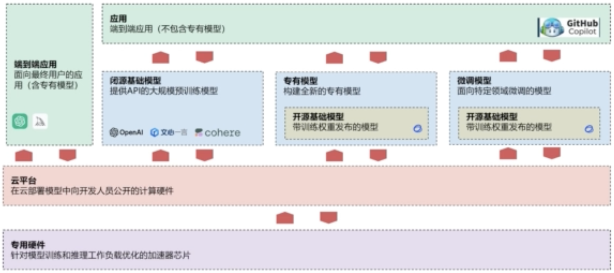

### 1. 时代 & 基础设施

- 工业时代：电力
- 信息化时代：网络
- 智能时代：大模型

### 2. AI / LLM的研究分类

- 基础研究：算法、架构、基础理论、性能优化等
- 应用研究：将AI应用到实际的业务场景中
    - 聊天应用只是大模型应用的初级形态
    - 各行各业+大模型+原有应用智能化

### 3. LLM（Large Language Model，大语言模型）：一种用大量数据训练的深度学习模型，给模型一些输入，它可以预测并返回相应的输出

- 基础概念
    - LLM：基于深度学习技术构建的人工智能模型，由具有数以亿计参数的人工神经网络组成，通过自监督学习或半监督学习在大量无标签文本上进行训练
        - 2018年出现，改变了自然语言处理研究的重点（LLM+微调去完成各种任务），不再是以训练特定任务的专门监督模型为范式
    - GPT（Generative Pre-trained Transformer，生成型预训练变换模型）：由OpenAI开发的一种LLM，旨在通过训练模型预测下一个单词或字符来学习自然语言的统计规律
    - LLM的上下文长度计算的基础计算单位是token（而不是字符）：在自然语言处理和文本处理任务中，会将文本分解成较小单元的基本单位；这些单元可以是单词、字符或其他语言单位，取决于任务和处理方式
        - 英语：字母、标点符号
        - 汉字：字（甚至是半个字、1/3个字）、词、符号
    - 词表：这个模型的所有token映射（token-id，id一般从0开始）
    - 工作流程：不断预测下一个词是什么，直到结束  
        -   
    - 预测token的机制
        - 最简单的办法就是基于大量数据的统计找到下一个token  
            -   
        - 假如输入的数据没在统计中：将文本转化成向量，用距离代替概率（向量的距离越近，发生的概率越高），得到概率最高的向量后再转化成文本
            -   
                - 词表向量：所有的token组成的表
    - 模型训练：将大量文本输入给模型，进而得到模型参数，从随机到智能；LLM训练一般需要2T以上的token  
        -   
            - 停止条件：输入”程”-输出“序”，输入“程序”-输出“员”
- ChatGPT
    - 本质是基于LLM开发的聊天机器人应用：理解上下文，根据用户指令生成流畅自然的文本
    - 局限性（需要一些技巧来规避）
        - 无法获取实时更新的信息：每次更新都需要训练LLM新增的内容，但训练的费用高昂且耗时，所以无法实时更新
        - 无法基于企业内部的信息进行回答：LLM的训练资料都来源于互联网公开资料集，企业的内部资料并不在其训练语料中，所以不会回答或者随意捏造事实来回答问题
        - 自信地将虚假或者错误的信息呈现给用户（如果不核实，很难发现错误->
          幻觉）：如果LLM的语料库中没有涵盖某些信息，ChatGPT不会拒绝回答某些问题，而是会自信地胡说八道
        - 处理长上下文或者复杂上下文时不连贯：e.g. 向ChatGPT提问超过模型能处理的上下文，或者对话次数过多，会出现无法响应的服务器错误
        - 数学能力有限，处理复杂数学问题时，结果往往是错的：LLM是通过大量参数预测下一个词出现的概率，用预测的方式不一定能计算数学问题，特别是复杂的数学问题
        - 默认无法与外部环境进行交互：默认情况下LLM没有接口与外部进行交互（e.g. 通过爬虫采集特定网站的信息），只有配置后才可以实现
        - 人机对话很强，但不一定是一种适合的交互方式：要不断提示ChatGPT才能准确完成任务

- 企业价值 & 市场需求
    - AGI（Artificial General Intelligence，人工通用智能）是AI的终极形态 -> 构建Agent（智能体）是AI工程应用的终极形态
        - Agent：具有自主性和智能的程序或系统，能够感知、规划、决策并执行相关任务  
            -   
        - LLM出现后，AI Agent衍生出一种新的架构模式，将最重要的推理决策部分或全部交由LLM完成
    - 所有产品都值得用AI重做一遍  
        -   
            - 落地案例
                - 智能客服
                - 数据分析->构建知识库等
                - AIaaS（AI as a Service）->将AI视为应用的后端服务
                    - 翻译服务 = 限定的预设Prompt + LLM规范化输出
                    - 自动化运维 = 日志采集 + LLM推理决策 + 工具包
- LLM对软件构建的影响
    - LLM在软件开发中的单点提效
        - 智能生成SQL语句
        - 智能代码提示
        - 生成代码注释
        - 静态代码检查与自动修复
        - 检查重复代码
        - 生成单元/接口测试代码
        - 失败用例的自动分析与归因
        - 代码评审与代码重构
        - 更精准的技术回答
        - 跨端代码的转换
    - 工具
        - GitHub Copilot（微软，VSCode，付费）
        - CodeGeeX（智谱，VSCode，免费）
    - 未来的架构  
        -   
            - 端到端应用：要学习如何使用LLM提升效率->Prompt工程师
            - 必源基础模型、专有模型、微调模型：构建、训练LLM，提升LLM的基础能力->LLM算法工程师
            - 应用：结合原来的应用去调用LLM的接口，开发LLM应用
    - AI时代自动化编程的5个等级（目前处于C3的初级阶段）
        - C1：基于当前代码进行自动补全
        - C2：编写代码时AI可以预测下一行代码
        - C3：基于自然语言去生成代码、将编程语言翻译成另一种编程语言
        - C4：高度自动化编程-根据自然语言生成代码及注释、代码补全&检查&调试、自动化测试、编程语言互译
        - C5：完全自动编程，可以把AI看成是一个软件，不需要写任何代码，基于AI本身即可提供对应的服务
    - 程序员在AI 2.0时代的机遇
        - 在创造性问题上（e.g.
          需求分析、架构设计等），AI无法取代程序员；AI目前只能帮助程序员完成代码的自动化测试、审查等重复性高、易出错的任务 ->
          不会导致程序员失业，而是会提高程序员的效率和准确性

### 4. LLM应用开发

- 专有名词
    - AIGC（AI Generated Content，AI生成内容）：通过对已有数据进行学习和模式识别，以适当的泛化能力生成相关内容的技术
        - content可以是文字、图像、音频、视频、虚拟人、游戏等
        - 泛化能力：多个方向、多个领域
    - AGI（Artificial General Intelligence，人工通用智能）：能够理解、学习和应用广泛知识与技能的人工智能系统
        - AGI是AI发展的最终目标，是一种能够思考、理解各种问题的智能体，就像人类一样
    - Agent（智能代理）：一个能够自主感知环境并采取行动的计算实体，其目标是最大化某种预定义的效用或实现特定的目标（e.g. 智能驾驶）
        - AGI是一种非常高级的Agent，具备广泛适应性和自我学习能力（e.g. 司机可以绘画，但是智能驾驶不能绘画）
    - Prompt（提示词）：给定一段文本或问题，用于引导和启发人工智能模型生成相关的回答或内容；是目前人类与LLM交互的核心方式
    - LoRA（Low-Rank Adaptation of LLM，插件式微调）：用于对LLM进行个性化的特定任务的定制；LoRA通过将模型的权重矩阵分解成低秩的相似矩阵，降低了参数空间的复杂性，从而减少微调的计算成本和模型存储要求
        - LLM的模型参数巨大
    - 矢量/向量数据库：可以存储和管理大量的矢量/向量数据（e.g. 文本、图像、音频、视频等），同时提供高效的检索功能；在智能推荐、人脸识别等领域应用广泛
    - 数据蒸馏：将给定的原始大数据集浓缩并生成一个小型数据集，使得在小数据集上训练出来的模型与原数据集上训练出来的模型相似，可以将复杂模型转换成更轻量级的模型，提高模型的鲁棒性和泛化能力
- LLM与AI Agent应用的交互模式
    - 传统的人机交互范式  
        -   
            - 人在外部环境的行为会产生数据，但人不能直接操作数据，而是将数据输入到软件，软件再输出处理后的数据给人
            - 处理不同的数据需要不同的软件，一个软件的交互接口复杂且多样化，而且每个软件的接口差异巨大（要花时间去学习不同的软件）
    - 大模型时代的人机交互范式  
        -   
            - 人不再直接操作软件，而是与LLM沟通（人只需要告诉LLM任务是什么，由LLM调用软件去处理数据）->
              LLM站到了人机交互的中心位置（也就是Agent），软件被屏蔽了（人不用再知道软件怎样操作，后端即服务）
                -   
                    - AI自己分解任务，逐个完成，直到整个需求完成
            - 长期来看，LLM会逐步替代各种功能的软件
        - 结合大模型的新一代应用交互方式
            - Embedding（嵌入模式）：用户与AI交流，AI协助完成（e.g. 创作小说、音乐等）；人类是指挥者和决策者，AI是执行工具
            - Copilot（副驾驶模式）：人类与AI合作，共同完成任务；AI提供建议并协助任务，这时AI更像知识丰富的伙伴而非工具
            - Agent（智能体模式）：人类设定目标并提供资源，AI独立完成大部分工作，最后人类监督和评估结果

### 5. LLMOps

- LLM到AI Agent的技术演进

|    | LLM                                                  | RAG（Retrieval-Augmented Generation）                                 | Agent                                                                                   |
|:---|:-----------------------------------------------------|:--------------------------------------------------------------------|:----------------------------------------------------------------------------------------|
| 定义 | LLM是利用大量文本数据训练的模型（如GPT系列、BERT等），能够生成连贯的文本、理解语言、回答问题等 | 检索增强生成技术结合了传统的信息检索技术和最新的生成式模型。它先从一个大型的知识库中检索出与查询最相关的信息，然后基于这些信息生成回答 | 智能体是指具有一定智能的程序或设备，能够感知外界环境并根据感知结果做出响应或决策的实体。它们可以是简单的软件程序或复杂的机器人                         |
| 作用 | LLM作为基础技术，提供了强大的语言理解和生成能力，是构建复杂人工智能系统的基石             | RAG可以视为在LLM基础上的扩展或应用，利用LLM的生成能力和外部知识库的丰富信息来提供更准确、信息丰富的输出            | 智能体可以利用LLM进行自然语言处理，通过RAG技术获得和利用知识，以在更广泛的环境中做出决策和执行任务。它们通常位于应用层级，是对LLM和RAG技术在特定环境下的集成和应用 | 

- OpenAI定义的AI Agent：以LLM为大脑驱动，具备记忆、规划、自主感知能力、使用工具的能力，能够自动执行并完成复杂任务的系统
    - 基础架构  
        -   
            - 工具是Agent与外界环境交互的窗口
    - 在ChatGPT对话中模拟一个Agent的运行流程：Agent的本质都是统一编码到Prompt（提示词）中并传递给LLM，然后程序根据LLM输出的内容执行不同的操作，反复执行，直到完成
        -   
            - Prompt：记忆+知识库+工具
            - 验证：人类提问
- LLMOps：管理LLM应用的生命周期的平台或者工具，涵盖了LLM应用的开发、配置、部署、运维；LLMOps的目的是简化和优化LLM应用的各个环节，以确保LLM应用高效、可靠、安全地运行，降低了企业创建AI
  Agent应用的成本，把复杂的部分留给了LLMOps开发者
    - AI Agent开发对比 -> 为什么需要LLMOps  
        -   
            - 不使用LLMOps：整理需求、编写Prompt、对接LLM接口、部署LLM、处理应用数据、AI工作流开发、应用工具开发（前后端交互开发、前后端部署）、记录日志
            - 使用LLMOps：整理需求、编写Prompt、选择LLM模型、上传数据勾选关联插件、可视化编排工作流、发布
    - LLMOps平台
        - Coze
        - Dify：云托管平台
            - 工作室
                - 聊天助手：与LLM对话
                - Agent：调用知识库、工具
                - 工作流：将大目标拆解成小目标（流程图+节点），逐步实现
                    - 发布成功后可以在Agent | 工具中添加该工作流，集成到应用中
            - 知识库：大文本->多个文本块，每个文本块都有关键词、向量
                - 命中测试？？？
            - 工具：本质是集成第三方接口，便于给应用调用
                - 内置：在project中统一配置API Key
                - 自定义

        - 语聚
        - 智谱清言
- 本课程的LLMOps项目：https://imooc.xitiya.com/ai_apaas/personalSpace?tabKey=app
    - 需求分析 -> 模块设计  
        -   
    - 学习目标
        - 精通LangChain框架的使用及底层原理（源代码）
        - 提炼并拆分AI应用开发需求，完成开发、配置、测试、部署、运维全流程
    - 解决的AI应用开发8大问题
        - Prompt编写：不同的LLM有不同的Prompt编写技巧
        - 多个不同的LLM接口对接到同一个AI应用中
        - 统计不同的LLM接口的输入与输出消耗，精准计算接口的消耗成本
        - 实现LLM的短期/长期记忆：通过最近的N条消息+长文总结，在context的长度限制内实现LLM的精准长期记忆与模糊长期记忆
        - 将复杂的需求转换成Agent，完成开发、配置、测试、部署、运维全流程
        - 解决不同成本下的RAG优化，涵盖本地搜索、向量搜索、搜索重排
        - 解决在不同场景下LLM回复时间过长的问题，涵盖流式响应、流式响应（不断输出片段）转正常响应（完整的内容）的技巧
        - AI工作流编排：将一个复杂的任务拆分成多个小任务，并完成工作流的合理编排与开发，使用不同的LLM解决不同的任务，提升性能、降低成本

### 6. ChatGPT：推荐使用4o（理解自然语言的能力更强大，支持上传图片、联网）

- Prompt使用技巧：可以问ChatGPT“请问要让你回答出最佳答案，有哪些重点和技巧？”
    - 明确问题：明确想了解的问题的范围和具体细节，避免过泛的问题
    - 提供背景/上下文
    - 限定范围：e.g. 版本、语言、地区、时间等
    - 拆分问题：先问、再问、继续问…...
    - 指出建议：告诉ChatGPT它已经回答了哪些问题，哪些问题不够详细、哪些问题出错了、哪些问题需要补充
    - 附加示例数据/文本到提问中
    - 多样提问：让ChatGPT按照多种格式请求来回复，得到不同角度的答案
    - 多试几次：在不修改Prompt的情况下让ChatGPT重复输出几次，都不行再修改Prompt
- 创建OpenAI的API Key（需要绑定国外的手机号+银行卡）
    - 推荐国外短信校验平台sms-activate：https://sms-activate.io/cn
    - OpenAI API的参数
        - 请求参数
        - 响应参数
            - 整体响应：一次性生成内容
            - 流式响应：每生成一点就返回一点
    - 国内代替品：MoonShot（月之暗面）
        - https://www.moonshot.cn/
        - 直接导入了OpenAI的包 -> 目前国内唯一一个可以不修改代码，只修改API Key+API就可以直接使用OpenAI
          SDK的大语言模型，而且MoonShot的参数和OpenAI几乎保持一致
        - API Key：sk-mQVEAU1Me0MeBdadR64pvQkB5sXK6iIaeWv4Xsd0fuuVTTZK
- OpenAI Platform（开放平台）：以“项目”为单位进行管理，可以统计每个项目的使用情况、给每个项目创建不同的API Key+配置权限控制->
  提高安全性
    - Playground：调试沙箱，可以用来快速调试Prompt与API参数，在开发时用来校验每个功能是否能够跑通
        - Chat：聊天机器人，可以调试不同的参数、对比不同的LLM
        - Assistants：也就是AI Agent
            - TOOLS
                - File search：也就是知识库
                - Code interpreter：代码解释器
            - Functions：可以添加不同的自定义函数（传入请求参数 -> 调试 -> 设置响应内容）
                - LOGS可以看到详细的运行过程
            - 课程实例
                - 用户输入：请帮我看下114.154.124.24这个ip所在城市的天气预报  
                -   
        - Completions：文本补全，被淘汰的功能（在OpenAI API docs的LEGACY中）
        - 目前OpenAI的Playground要充值才能使用，替代品：LangSmith
            - https://smith.langchain.com/o/5ec77d83-cee7-50ad-b87d-2d58a3c4237c/playground
    - Assistants：配置Playground中创建的Assistants
    - Fine-tuning：上传Training data对指定的LLM进行微调
    - Batches：上传请求数据，批量访问某个Endpoint
    - Storage：上传文件，然后在Playground | Assistants | TOOLS | File search中调用 -> 实现历史记忆、外置知识库
    - Usage：统计使用情况
    - API keys：创建不同的API Key+配置权限控制
