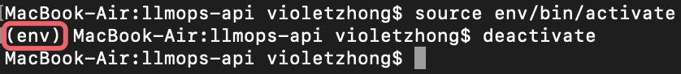
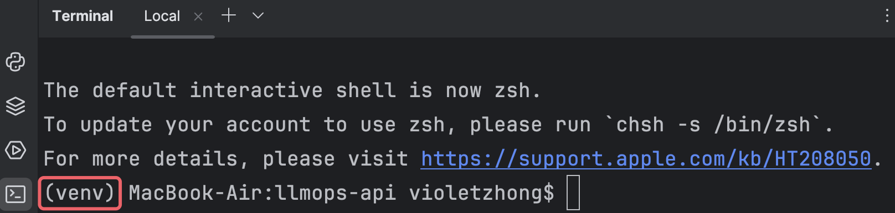
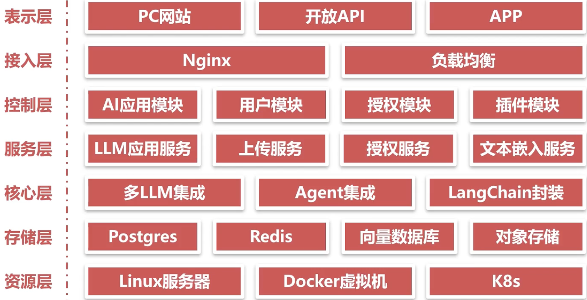
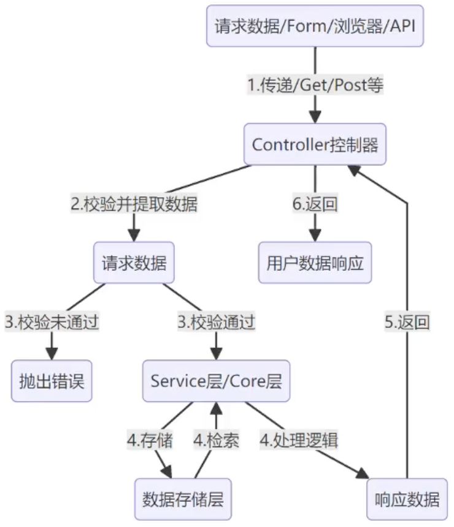

### 1、后端语言选择

- Python的性能不如Java等编译型语言，但有丰富的生态系统（AI开源模型、机器学习基础库等）

### 2、Python环境搭建与项目配置

- 版本选择
    - prerelease：预发布版本
    - bugfix：prerelease和security之间的版本
    - security：稳定版本，推荐在生产环境中使用
- 虚拟环境
    - $ python3 -m venv envName // 创建虚拟环境，m代表module
    - 优点：Python安装在系统环境中，虚拟环境是与系统环境隔离的，不同的虚拟环境不会互相影响（推荐一个项目一个虚拟环境，避免包冲突）
    - 缺点：相同的包可能会安装多次->占用更大的空间，进入虚拟环境：$ activate，退出虚拟环境：$ deactivate
    - 本项目：在/Users/violetzhong/WorkspacePython/llmops/llmops-api目录下创建了一个虚拟环境venv
        - $ cd llmops-api所在目录
        - $ chmod +x venv/bin/activate
        - $ source venv/bin/activate
        - $ deactivate
        -   
- 编辑器：PyCharm
    - Settings | Project | Python Interpreter | Add Interpreter
        - Virtualenv Environment | Existing | select the env folder
        -   
- LLMOps项目的7层架构与框架选择
    -   
        - 表示层 / 用户层：接收用户请求
        - 控制层（controller）：接收请求，调用服务，返回响应
        - 服务层 / 逻辑层（service）：完成特定的功能
        - 每一层只能和自己的直接上层和直接下层打交道，不能跨层调用 -> 代码解耦，提升程序的可扩展性（微服务）
    - Flask：轻量级框架，性能比Django强
    - LangChain：封装了很多LLM的实现细节，统一成标准的接口
- 代码运行流程图
    -   
- 项目的目录结构
    - 命名规范
        - 文件名/模块名：全小写，使用下划线分割单词；尽可能保证文件作用的单一
        - 类名：每个单词的首字母都大写，不分割
        - 函数名（方法）：全小写，使用下划线分割单词
        - 变量名：全小写，使用下划线分割单词
        - 常量：全大写，使用下划线分割单词
        - 私有变量与方法（不能被外部调用）：以下划线开头表示私有
    - 依赖注入（Dependency
      Injection）：软件工程的一种设计模式，用于实现对象之间的解耦和组件重用；组件不再自己负责创建、管理依赖项，而是将这些依赖项由外部的容器注入到组件中 ->
      组件不再需要关心如何创建和维护依赖项，而是专注于自身的功能
        - Injector：Python的一个轻量级依赖注入框架，通过@inject（一般在类级别注入）和Injector实例（injector = Injector()
          ）实现依赖注入，不需要显示创建依赖对象
            - $ cd projectDir
            - $ pip install injector
    - 依赖库：参考项目的Notes.md 1-6
- API调试
    - 推荐：Postman
        - Request
            - params: query params, path variable
            - body
    - 国内代替品：https://www.apipost.cn/
- 数据库：Postgres
